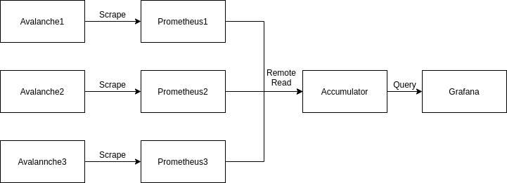

# Prometheus remote read

## Architecture

* There are three [Avalanche](https://github.com/open-fresh/avalanche) containers that generate test metrics
* Three [Prometheus](https://github.com/prometheus/prometheus) instances, each of which scrape one Avalanche container as well as itself
* A fourth Prometheus instance (Accumulator) which is configured to remote read from the other three Prometheus containers
* [Grafana](https://github.com/grafana/grafana) with all four Prometheus instances configured as datasources to make testing easier




## Running

```bash
docker-compose up
```

Grafana will be accessible at [locahost:3000](http://locahost:3000)  
Prometheus will be accessible at [locahost:9090](http://locahost:9090),[9091](http://locahost:9091),[9092](http://locahost:9092)  
Accumulator will be accessible at [localhost:9099](http://localhost:9099)  
Avalanche will be accessible at [locahost:9001](http://locahost:9001),[9002](http://locahost:9002),[9003](http://locahost:9003)  